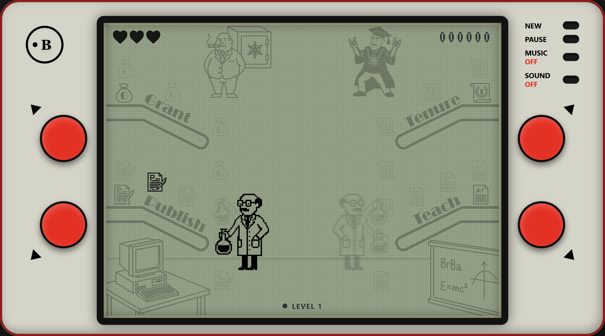

# Researcher's Zugzwang

*Click the screen above to play the game!*

## 🔬 About The Game
**Researcher's Zugzwang** is a retro, 1980s-style LCD electronic game built for the modern web. 

Step into the shoes of an overwhelmed academic scientist trying to balance the relentless demands of university life. You must quickly catch falling duties and opportunities before they crash to the floor.

### 🎒 The Academic Duties:
*   📄 **Grants (Top-Left):** Crucial funding that appears every 10 rounds.
*   📖 **Manuscripts (Bottom-Left):** Your standard publishing output.
*   💼 **Teaching (Bottom-Right):** Your daily teaching responsibilities.
*   ⭐ **Tenure / Job Offers (Top-Right):** Extremely fast-falling, high-value opportunities that only appear every 25 rounds!

## 🕹️ Controls

**Desktop / Laptop:**
*   **W / A / S / D** or **Arrow Keys** to move the scientist's hands to the 4 corners.
*   **P** to Pause the game.
*   **Spacebar** to return to the neutral position.

**Mobile / Smartphone:**
*   **Tap** the red D-pad buttons to move.
*   **Tap the LCD glass** to instantly Pause/Unpause the game.
*   Use the **Screen MAX** button to enter full-screen mode and hide the browser UI.

## 🛠️ Tech Stack
This game was built using modern web technologies while simulating physical retro hardware limitatons (like LCD ghosting and fixed-grid updating):
*   **React 19**
*   **TypeScript**
*   **Tailwind CSS v4** (using Container Queries for flawless scaling on all devices)
*   **Vite**

---
